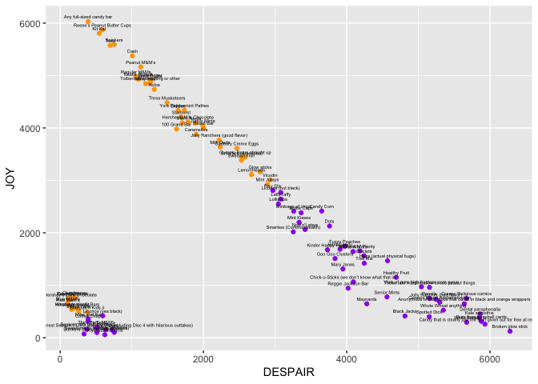

```r
library(tidyverse)
library(here)

# columns were not reading correctly as first 1000+ entries are NA for these
# columns. Hence they have been directly assigned the correct column types.
candy_data <- read_csv(here("data/clean_data/candy.csv"), col_types = cols(
  sex = col_character(),
  country = col_character()
))
```

# Data Cleaning Process

The initial dirty data exists in the three separate files which have been
individually cleaned and then combined (with a bind).

The dirty data has been passed through a cleaning script which has:

+ cleaned the column names
+ removed columns not relevant to analysis (e.g. "Please estimate the degrees of
separation between you and Beyonce")
+ renamed columns for consistency across the three independent datasets - 
sometimes the same candies appear under slightly different names:


```r
peanut_m_ms = peanut_m_m_s,
bonkers_the_candy = bonkers
```

+ only accept integer values for age: in some cases the data was entered as a
double number (35.0) or text. Text ages have been converted to NA and any
numerical value converted to the closest whole number.

Each dirty data file was passed through a bespoke script as there were few
cleaning operations that applied to all 3. (They were each dirty in their own,
unique way)

After being cleaned, the data was passed through another script which:

+ passed each dataset through a function, converting them to a standard long format


```r
make_data_long <- function (wide_data) {
  long_data <- wide_data %>% 
    pivot_longer(-year & -trick_treating & -sex & -age & -country,
                 names_to = "candy",
                 values_to = "rating") %>%
    select(year, age, sex, country, trick_treating, candy, rating)
}
```

+ passed each dataset through a function, filtering out "empty" rows in the data


```r
remove_empty_rows <- function(data) {
  data %>%
  verify(ncol(data)==7)
  
  filtered_data <- data %>% 
    filter(!(is.na(trick_treating) &
               is.na(sex) &
               is.na(age) &
               is.na(country) &
               is.na(rating)))
}
```

+ used a row bind operation to combine the three datasets into one large dataset
+ cleaned up the country column by using country-specific string patterns:
`UK_patterns <- "u[.]*k|in[g]*[d]*om|england|scotland"`
+ in cases where no age was recorded AND a number was recorded in the country
column, the number has been assumed to correspond to the respondents age and
moved to the appropriate column.
+ assigned each recognised country pattern to one of the desired countries:
USA, UK, Canada, Other

# Analysis

## Candy Ratings

What is the total number of candy ratings given across the three years?

The question asks us to count the number of candy ratings, discounting any NAs.

```r
n_ratings <- candy_data %>%
  filter(!is.na(rating)) %>% 
  nrow()
```
After the filtering any NA ratings: the total number of candy ratings across
the three years is: *

```
## [1] 660750
```

## Trick or Treating age

What was the average age of people who are going out trick or treating?

The data has a variable `trick_treating` which relates to whether or not people went
trick or treating. TRUE indicates they went out.

Filtering the data for the case when `trick_treating` is TRUE gives the subset of
people who went trick or treating. Then looking at one candy that appears every
year (this way each person will appear in the data only once), the data can be
summarised and the average age can be found.

```r
average_age_extroverts <- candy_data %>% 
  filter(trick_treating == TRUE) %>%
  filter(candy == "snickers") %>% 
  select(age) %>%
  summarise(average_age = mean(age, na.rm = TRUE)) %>% 
  pull()
```

The average age of trick or treaters across all three years was found to be:


```
## [1] NaN
```

## Trick or Treat abstainers

How does this compare to the average age of people who stay inside?

The process is the same as previously, but filtering `trick_treating` is FALSE -
indicating the person did not go trick or treating.


```r
average_age_introverts <- candy_data %>% 
  filter(trick_treating == FALSE) %>%
  filter(candy == "snickers") %>% 
  select(age) %>%
  summarise(average_age = mean(age, na.rm = TRUE)) %>% 
  pull()
```

The average age of people who did not go trick or treating was:


```
## [1] NaN
```
## Joy / Despair / Meh

For each of joy, despair, and meh, which candy bar revived the most of these
ratings?

Calculation process:

The data has a variable `rating` which relates to the ratings of the question.
i.e. joy, despair, and meh. By filtering this column, the total ratings of
each type can be calculated.

To calculate only the ratings of joy:

```r
only_joy <- candy_data %>% 
  filter(rating == "JOY") %>% 
  add_count(candy) %>% 
  group_by(candy) %>%
  summarise(joyful_ratings = mean(n), .groups = 'drop') %>% 
  arrange(desc(joyful_ratings))
```

To calculate only the ratings of "meh":


```r
only_apathy <- candy_data %>% 
  filter(rating == "MEH") %>% 
  add_count(candy) %>% 
  group_by(candy) %>%
  summarise(mehful_ratings = mean(n), .groups = 'drop') %>% 
  arrange(desc(mehful_ratings))
```

To calculate only the ratings of despair


```r
only_despair <- candy_data %>% 
  filter(rating == "DESPAIR") %>% 
  add_count(candy) %>% 
  group_by(candy) %>%
  summarise(woeful_ratings = mean(n), .groups = 'drop') %>% 
  arrange(desc(woeful_ratings))
```

## Starbust Sadness

How many people rated Starburst as despair?


```r
saddened_by_starburst <- candy_data %>% 
  filter(rating == "DESPAIR",
         candy == "starburst") %>% 
  nrow()
```


```r
saddened_by_starburst
```

```
## [1] 0
```

<hr>

For the next three questions apply the following conversion:

|rating|Scoring|
|---|---|
|Joy| 1|
|Despair|-1|
|Meh| 0|

## The Loved

What was the most popular candy bar for each sex in the dataset?

To find the the most popular candy for each sex, first take a selection of
only the desired columns - in this case: `candy`, `sex`, and `rating`.
Convert each rating into the score, group the entries and then sum to get the
total score for each candy for each sex.


```r
favourites_by_sex <- candy_data %>% 
  select(candy, sex, rating) %>%
  mutate(rating = case_when(
    rating == "JOY" ~ 1,
    rating == "DESPAIR" ~ -1,
    TRUE ~ 0
  )) %>% 
  group_by(sex, candy) %>% 
  summarise(score = sum(rating), .groups = 'drop_last' ) %>% 
  slice_max(score, n = 2)
```

The question asked for the most popular but I've included the second most
popular as well for further comparison.

<div data-pagedtable="false">
  <script data-pagedtable-source type="application/json">
{"columns":[{"label":["sex"],"name":[1],"type":["chr"],"align":["left"]},{"label":["candy"],"name":[2],"type":["chr"],"align":["left"]},{"label":["score"],"name":[3],"type":["dbl"],"align":["right"]}],"data":[{"1":"Female","2":"Any full-sized candy bar","3":"338"},{"1":"Female","2":"Cash","3":"335"},{"1":"Male","2":"Any full-sized candy bar","3":"658"},{"1":"Male","2":"Kit Kat","3":"589"},{"1":"Other","2":"Any full-sized candy bar","3":"16"},{"1":"Other","2":"Kit Kat","3":"14"},{"1":"Unspecified","2":"Any full-sized candy bar","3":"4628"},{"1":"Unspecified","2":"Reese’s Peanut Butter Cups","3":"4395"}],"options":{"columns":{"min":{},"max":[10]},"rows":{"min":[10],"max":[10]},"pages":{}}}
  </script>
</div>

## Year-by-year most popular

What was the most popular candy bar in each year?

To find the highest scoring candy for each year, the process is similar to
above. Selecting year and then grouping by candy, a score for each can be
calculated with `sum` and then a slice can be taken to see the highest scorers.


```r
favourites_by_year <- candy_data %>% 
  select(candy, year, rating) %>%
  mutate(rating = case_when(
    rating == "JOY" ~ 1,
    rating == "DESPAIR" ~ -1,
    TRUE ~ 0
  )) %>% 
  group_by(year, candy) %>% 
  summarise(score = sum(rating), .groups = 'drop_last') %>% 
  slice_max(score, n = 2)
```

The top 2 are listed. "any full sized candy bar" is a common high scorer.
<div data-pagedtable="false">
  <script data-pagedtable-source type="application/json">
{"columns":[{"label":["year"],"name":[1],"type":["dbl"],"align":["right"]},{"label":["candy"],"name":[2],"type":["chr"],"align":["left"]},{"label":["score"],"name":[3],"type":["dbl"],"align":["right"]}],"data":[{"1":"2015","2":"Any full-sized candy bar","3":"4603"},{"1":"2015","2":"Reese’s Peanut Butter Cups","3":"4375"},{"1":"2016","2":"Any full-sized candy bar","3":"1037"},{"1":"2016","2":"Cash","3":"948"}],"options":{"columns":{"min":{},"max":[10]},"rows":{"min":[10],"max":[10]},"pages":{}}}
  </script>
</div>

## Candy Preference by Country

What was the most popular candy bar for people in US, Canada, UK and all other countries?

The rating process is the same as before. This time the country column is
selected. The data has already been wrangled into the three desired countries,
other countries, and NA (where either no country was provided, or there was an
error with the entry.) Again grouping for each distinct candy and then taking a
slice of the summary, the highest scoring candies for each country can be
examined.


```r
favourites_by_country <- candy_data %>% 
  select(candy, country, rating) %>% 
  mutate(rating = case_when(
    rating == "JOY" ~ 1,
    rating == "DESPAIR" ~ -1,
    TRUE ~ 0
  )) %>% 
  group_by(country, candy) %>% 
  summarise(score = sum(rating), .groups = 'drop_last') %>% 
  slice_max(score, n = 2, with_ties = FALSE)
```

The question asked for the top 1 candy, but the top two have been included since
"any full sized candy bar" has a high score in every country category.

<div data-pagedtable="false">
  <script data-pagedtable-source type="application/json">
{"columns":[{"label":["country"],"name":[1],"type":["chr"],"align":["left"]},{"label":["candy"],"name":[2],"type":["chr"],"align":["left"]},{"label":["score"],"name":[3],"type":["dbl"],"align":["right"]}],"data":[{"1":"CANADA","2":"Any full-sized candy bar","3":"109"},{"1":"CANADA","2":"Kit Kat","3":"95"},{"1":"OTHER","2":"Any full-sized candy bar","3":"28"},{"1":"OTHER","2":"Cash","3":"28"},{"1":"UK","2":"Cash","3":"16"},{"1":"UK","2":"Milky Way","3":"15"},{"1":"Unspecified","2":"Any full-sized candy bar","3":"4626"},{"1":"Unspecified","2":"Reese’s Peanut Butter Cups","3":"4393"},{"1":"USA","2":"Any full-sized candy bar","3":"864"},{"1":"USA","2":"Cash","3":"788"}],"options":{"columns":{"min":{},"max":[10]},"rows":{"min":[10],"max":[10]},"pages":{}}}
  </script>
</div>

Plotting candy preferences


```r
counting_despair <- candy_data %>%
  group_by(candy) %>% 
  add_count(rating, name = "n_rating") %>%
  select(candy, rating, n_rating) %>% 
  unique() %>% 
  drop_na(rating) %>%
  pivot_wider(names_from = rating, values_from = n_rating) %>% 
  drop_na() %>% 
  mutate(colour = ifelse(JOY/DESPAIR > 1, "orange", "purple"))
```


```r
ggplot(counting_despair, aes(x = DESPAIR, y = JOY, color = colour), label = candy) +
  geom_point()+
  geom_text(aes(label=candy), size = 1.5,hjust=0.5, vjust=-1, color = "black") +
  scale_color_identity()
```

<!-- -->

